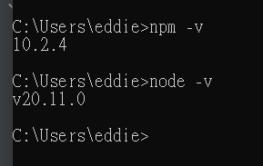

# 安裝Node.js和Visual Studio Code

## 0.1 安裝Node.js

Node.js是一個基於Chrome V8引擎的JavaScript運行環境，它讓開發者可以使用JavaScript來編寫伺服器端的應用程序。以下是安裝Node.js的步驟：

### 1. 下載Node.js
- 訪問[Node.js官方網站](https://nodejs.org/)。
- 根據您的操作系統選擇相應的版本進行下載。建議下載LTS（Long Term Support）版本，因為它更穩定。

### 2. 安裝Node.js
- 打開下載的安裝包，跟隨安裝向導指示完成安裝。
- 安裝過程中，確保勾選了“Add to PATH”選項，這樣您才可以在命令行或終端中直接訪問Node.js。

### 3. 驗證安裝
- 打開命令行或終端。
- 輸入`node -v`和`npm -v`來檢查Node.js和npm（Node.js的包管理器）是否已正確安裝。如果顯示出版本號，則表示安裝成功。
  ```shell
  node -v
  ```
  

    安裝成功示意圖

## 0.2 安裝Visual Studio Code

Visual Studio Code（VS Code）是一款輕量級但功能強大的源程式碼編輯器，支持眾多編程語言。以下是安裝VS Code的步驟：

### 1. 下載Visual Studio Code
- 訪問[Visual Studio Code官方網站](https://code.visualstudio.com/)。
- 下載適合您操作系統的版本。

### 2. 安裝Visual Studio Code
- 打開下載的安裝包，跟隨安裝向導指示完成安裝。
- 安裝完成後，啟動VS Code。

## 0.3 安裝基本套件

VS Code通過擴展（Extensions）提供額外功能。對於JavaScript開發，以下是一些推薦的擴展：

### 1. 安裝Live Server
- 在VS Code中，打開擴展視圖（View > Extensions）。
- 搜索“Live Server”並安裝。這個擴展可以讓你輕鬆地在本地開發伺服器上預覽你的網頁。

### 2. 安裝Prettier
- 同樣在擴展視圖中，搜索“Prettier - Code formatter”並安裝。
- Prettier是一個程式碼格式化工具，可以幫助你保持程式碼的一致性和可讀性。

## 0.4 網頁除錯工具

### 1. Chrome瀏覽器
- 右鍵點擊網頁，選擇“檢查”或“檢查元素”。
- 或者按下`F12`鍵打開開發者工具。
- 這相當於瀏覽器的除錯工具，可以幫助你檢查網頁的HTML、CSS和JavaScript程式碼，並進行除錯和測試。

### 2. React Developer Tools
- 安裝React Developer Tools擴展，它可以幫助你除錯和測試React應用。
- 下載連結 [React Developer Tools](https://react.dev/learn/react-developer-tools)
