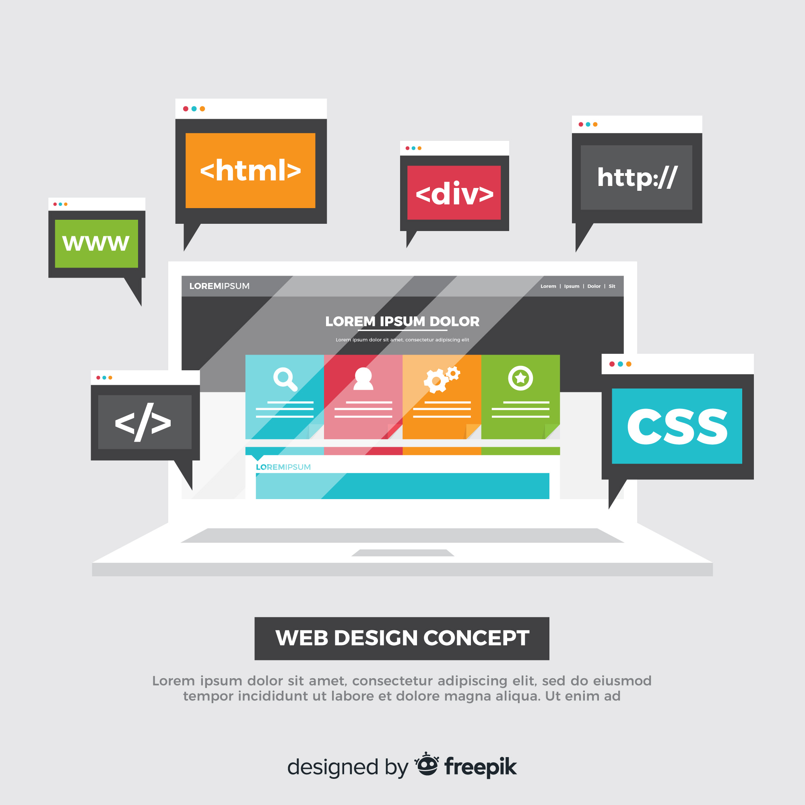

# 第1章：HTML概述

## 1.1 網頁開發基礎

在進入HTML的具體學習之前，我們首先需要了解網頁開發的三個基石：HTML、CSS和JavaScript。這三者合作，共同構建出現代網頁的外觀、樣式和功能。

- **HTML (HyperText Markup Language)** 是網頁的骨架，負責結構的定義和內容的組織。HTML通過「標籤」來標示不同的內容類型，如文本、圖片和鏈接等。
- **CSS (Cascading Style Sheets)** 負責網頁的視覺表現，包括佈局、顏色和字體等。CSS允許開發者將設計風格與HTML結構分離，使網頁設計更加靈活和易於維護。
- **JavaScript** 是實現網頁動態效果和互動功能的腳本語言。它可以讓網頁對用戶操作做出響應，如表單提交、彈窗通知和內容更新等。

了解這三者的基本角色和互動方式，對於學習網頁開發至關重要。

## 1.2 HTML歷史和版本

HTML自從1991年由Tim Berners-Lee發明以來，經歷了多個版本的演進，每個版本都在不斷增加新的功能和改進，以滿足日益增長的網絡需求。

- **早期的HTML** 版本著重於文檔的結構，提供了基本的文本格式化和超鏈接功能。
- **HTML 4.01**（1999年發布）引入了更多的互動性和多媒體元素，比如表格、圖像和表單，為更復雜的網頁設計奠定了基礎。
- **XHTML**（可擴展超文本標記語言）是一種以XML格式化的HTML，要求更嚴格的文檔規範，以促進更好的跨瀏覽器兼容性。
- **HTML5** 是最新的標準，於2014年正式成為國際標準。HTML5引入了許多重要的新特性和改進，包括新的結構和語義標籤（如`<header>`, `<footer>`, `<article>`, `<section>`等），以及嵌入音頻和視頻的直接支持，還有更強大的表單控件和APIs，支持更複雜的網頁應用開發。

HTML5的新特性標誌著網頁技術進入了一個新的時代，為開發者提供了更多的可能性，使得網頁不僅僅是靜態信息的展示，更成為了互動式應用的平台。

Image by <a href="https://www.freepik.com/free-vector/colorful-web-design-concept-with-flat-design_3189862.htm#query=html%20css%20javascript&position=55&from_view=keyword&track=ais&uuid=de6f1637-eac0-4a18-878b-a4680542f740">Freepik</a>