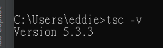

# 第1章：TypeScript快速入門

## 1.1 TypeScript的優勢

### 靜態類型的好處

靜態類型系統可以在編譯時期捕獲錯誤，而不是在運行時。這意味著更早地發現問題，並且可以提供更好的自動完成和程式碼導航功能。此外，靜態類型有助於文檔化，使得程式碼更容易理解和維護。

### TypeScript與JavaScript的區別

TypeScript是JavaScript的超集(Super-Set 也就是包含 Sub-Set 全部功能)，這意味著它包含了所有JavaScript的功能，並在此基礎上增加了類型系統和其他特性。這使得TypeScript非常適合用於大型和複雜的項目，可以提高開發效率和程式碼質量。

### 業界與趨勢

TypeScript在一些大型項目中的使用率越來越高，很多公司都要求使用TypeScript來開發項目。並在面試中要求應聘者熟悉TypeScript。這些都表明TypeScript的重要性和前景。


圖片來源 https://blog.jetbrains.com/webstorm/2024/02/js-and-ts-trends-2024/


圖片來源 https://github.blog/2023-11-08-the-state-of-open-source-and-ai/


## 1.2 配置TypeScript環境

### 安裝TypeScript

要開始使用TypeScript，首先需要安裝TypeScript編譯器。這可以通過npm（Node.js的包管理器）來完成。

Windows 請用系統管理員開啟命令提示字元或終端機，然後執行以下命令：
```bash
npm install -g typescript
```
若是 Mac 或 Linux 系統，可能需要在命令前加上 `sudo` 以提升權限。
```bash
sudo npm install -g typescript
```

檢查安裝
```bash
tsc -v
```

安裝正確會顯示



## 1.3 編譯TypeScript

### 為什麼需要編譯TypeScript

TypeScript擴展了JavaScript的語法，添加了靜態類型和其他特性，這些在運行時並不直接由JavaScript引擎支持。因此，TypeScript程式碼不能直接在瀏覽器或Node.js環境中運行，它需要被編譯（或轉譯）成標準的JavaScript程式碼。這個過程涉及到從TypeScript文件中移除類型註解，並根據配置轉換語法特性，以保證生成的JavaScript程式碼能夠在目標運行時環境中正常運行。

### 編譯過程

TypeScript編譯器（`tsc`）負責將TypeScript程式碼轉換成JavaScript程式碼。編譯過程中，編譯器會執行語法檢查，確保程式碼符合TypeScript的規則，這包括檢查類型錯誤、接口實現是否完整等。如果發現任何錯誤，編譯器會報告這些錯誤，編譯過程將不會繼續進行，直到所有錯誤被修正。

## 1.4 練習題: 編寫第一個TypeScript文件

創建一個檔案`hello.ts`，並加入以下TypeScript程式碼：

```typescript
function greet(person: string): string {
    return "Hello, " + person;
}

console.log(greet("World"));
```

### 配置tsconfig.json

進入練習題目錄，你需始終確定你的 Terminal 或 Command Prompt 的當前目錄是在練習題目錄下。
```bash
cd "CH1 練習題"
```

初始化TypeScript配置文件
```bash
tsc --init
```

`tsconfig.json`文件用於配置TypeScript編譯選項。項目根目錄下已經有創建一個`tsconfig.json`文件，請修改成以下內容：

```json
{
  "compilerOptions": {
    "target": "es5",
    "module": "commonjs",
    "strict": true,
    "esModuleInterop": true,
    "outDir": "./dist"
  }
}
```

這個配置指定了輸出目標為ES5，模塊系統使用CommonJS，開啟嚴格模式，允許ES模塊互操作性，並將編譯後的文件輸出到`dist`目錄。

要編譯TypeScript文件，並使用`tsconfig.json`中的配置，可以執行以下命令：

```bash
tsc --build tsconfig.json
```
你會發現產生了一個`dist`目錄，裡面有一個`hello.js`文件。

如果只是編譯單個文件，可以執行以下命令：

```bash
tsc hello.ts
```
這樣方式會生成一個相應的`hello.js`文件，在同一目錄下。

這會生成一個相應的`hello.js`文件，你可以用Node.js執行這個文件。
