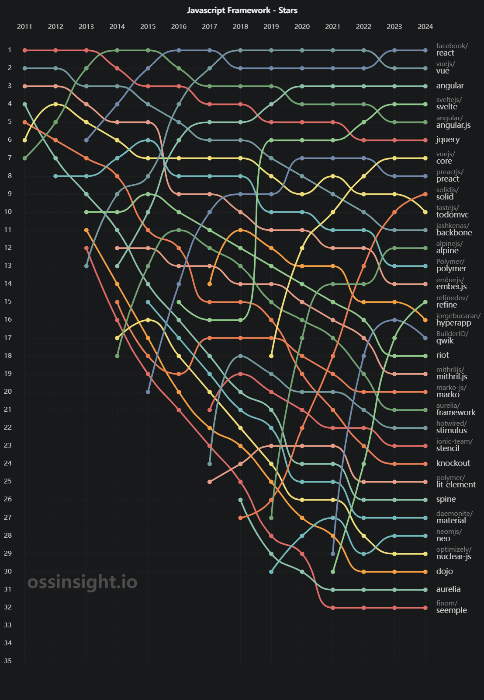

# 第一章: React 入門介紹
歡迎來到React的世界！本課程旨在為完全沒有React經驗的學生提供一個全面的入門指南。我們將從最基本的概念開始，逐步深入，以確保你能夠獲得堅實的React基礎。

## 1.1 什麼是 React？

* React是一個由Meta (Facebook) 開發並維護的開源JavaScript庫，用於構建用戶界面（UI）。它使得創建互動式、狀態驅動的Web應用變得既簡單又快速。
* 在此之上，隨者 React Native 的出現，React 也能夠用於構建原生移動應用。

## 1.2 React的核心概念

- **組件（Components）**：React應用由多個組件構成，每個組件負責渲染應用的一小部分UI。
- **JSX**：一種語法擴展，讓你在JavaScript程式碼中能夠寫類似HTML的標記。
- **狀態（State）**和**屬性（Props）**：組件的兩個核心概念，用於控制組件渲染的內容。
- **生命週期方法（Lifecycle Methods）**：特定時期自動被調用的組件方法，用於執行程式碼和管理組件的生命週期。

## 1.3 為什麼學習 React？

React的設計哲學和強大的功能集，使其成為當今Web開發的首選技術之一：

- **高效**：React通過虛擬DOM來最小化真實DOM的操作，提高應用性能。
- **靈活**：React可以與其他庫或框架（如React Router、React Bootstrap等）無縫集成，滿足不同項目的需求。
- **生態系統**：豐富的社區、工具和庫使得開發React應用更加容易和高效。(把想要效果 + React 搜尋，然後就像 pip 一樣安裝即可)
- **與業界接軌**：根據 JetBrains 的調查，React 是 2024 年最受歡迎的前端框架。

圖片來源 https://blog.jetbrains.com/webstorm/2024/02/js-and-ts-trends-2024/

目前 React 在 2023 年後超越 Vue，成為最受歡迎的前端框架。

圖片來源 https://ossinsight.io/collections/javascript-framework/

## 1.4 實際案例演示：學校選課助手

為了更好地理解React在實際開發中的應用，我將在本課程中介紹一個我自己開發的項目 —— 學校選課助手。這個應用展示了React的強大功能，以及如何使用React來構建互動式和用戶友好的Web應用。

### 1.4.1 選課助手的功能特點：

- **用戶界面**：採用React構建，提供清晰直觀的操作體驗，相比第四代純JavaScript版本，性能大幅提升。
- **動態數據處理**：利用React的狀態管理（State）和生命週期方法（Lifecycle Methods）實時更新課程篩選結果。
- **互動性**：通過事件處理（如點擊、過濾）實現與用戶的互動。
- **數據驅動**：展示如何使用Props傳遞數據，以及如何將外部數據集成到React應用中。

### 1.4.2 項目地址
- [中山大學選課助手5.0](https://whats2000.github.io/CourseSelectorHelperReact/)
- [項目源碼](https://github.com/whats2000/CourseSelectorHelperReact)

  

## 1.5 開發工具
- **編輯器**：
  - 使用 [Visual Studio Code](https://code.visualstudio.com/) 作為開發工具。
  - 使用 [WebStorm](https://www.jetbrains.com/webstorm/) 作為開發工具。
- **輔助工具**：
  - 安裝 [React Developer Tools](https://react.dev/learn/react-developer-tools)
- **VS Code Extension**：
  - [ES7+ React/Redux/React-Native snippets](https://marketplace.visualstudio.com/items?itemName=dsznajder.es7-react-js-snippets)
  - [VSCode React Refactor](https://marketplace.visualstudio.com/items?itemName=planbcoding.vscode-react-refactor)
  - [Prettier](https://marketplace.visualstudio.com/items?itemName=esbenp.prettier-vscode)
  - [Import Cost](https://marketplace.visualstudio.com/items?itemName=wix.vscode-import-cost)

圖片來源 https://blog.jetbrains.com/webstorm/2024/02/js-and-ts-trends-2024/

# 參考資料
- [React 官方網站](https://reactjs.org/)
