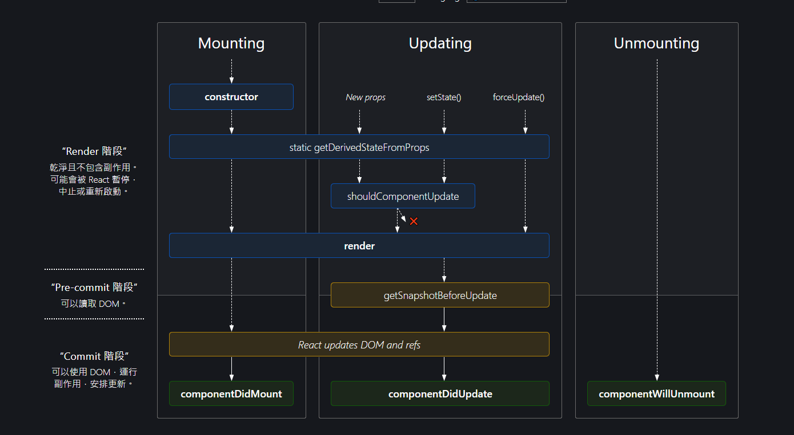

# 第二章: 了解 React 的基本概念

在深入瞭解React之前，讓我們先回顧一下Web開發中的一些基本概念，特別是DOM（文件對象模型）的操作。然後，我們將探討React如何透過虛擬DOM來提升性能和效率。

## 2.1 DOM 簡介

DOM（Document Object Model）是一個跨平台和語言獨立的接口，允許程序和腳本動態地訪問和更新文檔的內容、結構以及樣式。在網頁開發中，DOM提供了表示和與HTML或XML文檔交互的方法。

### 原生 JavaScript 中的 DOM 操作

在原生JavaScript中，我們經常使用以下方法來操作DOM：

- `document.getElementById()` 或 `document.querySelector()` 用於選擇DOM元素。
- `element.innerHTML` 或 `element.textContent` 用於修改元素的內容。
- `element.setAttribute()`、`element.classList.add()` 等用於修改元素的屬性或樣式。
- `element.appendChild()` 用於向DOM中添加新元素。

#### 示例：原生JavaScript掛載元素

```javascript
// 創建一個新的div元素
const newDiv = document.createElement("div");

// 為它添加一些文本內容
newDiv.textContent = "Hello, World!";

// 掛載到DOM中
document.body.appendChild(newDiv);
```

#### 或者你有用jquery的話

```javascript
// 創建一個新的div元素
const newDiv = $("<div>");

// 為它添加一些文本內容
newDiv.text("Hello, World!");

// 掛載到DOM中
$("body").append(newDiv);
```
但是，這些方式雖然直接，但在處理大型應用或復雜交互時可能會變得繁瑣且難以維護。

## 2.1 React 與虛擬 DOM
React引入了虛擬DOM（Virtual DOM）的概念，來優化DOM的操作。虛擬DOM是一種在內存中重新創建DOM樹的技術。當狀態變化時，React會先對虛擬DOM進行更改，然後將更改前後的虛擬DOM進行比較，最後只將差異應用到實際的DOM上，從而達到提升性能的目的。

### 虛擬 DOM 的優勢
* 效能提升：通過減少直接操作DOM的次數來提升應用的性能。
* 開發效率：React的宣告式API讓開發者不需要直接操作DOM，只需關注於狀態管理和UI邏輯，從而提升開發效率。
* 跨平台：虛擬DOM的概念使得React能夠被應用到Web以外的平台，如React Native開發的移動應用。

React通過虛擬DOM來抽象化複雜的DOM操作和更新過程，使得開發大型應用和高性能的界面變得更簡單、更快捷。



具體原理圖 (參考用就好)
圖片來源: https://projects.wojtekmaj.pl/react-lifecycle-methods-diagram/
