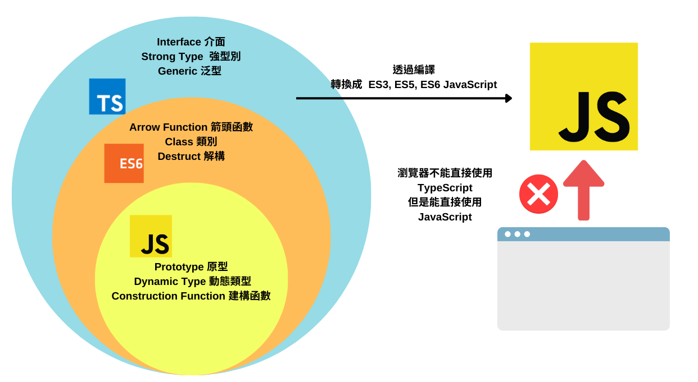

# TypeScript介紹

歡迎來到TypeScript世界！TypeScript是JavaScript的一個超集，它在JavaScript的基礎上增加了類型系統和一些其他特性，這使得JavaScript的開發變得更加容易和強大。本課程將引導你了解TypeScript中的現代語法特性以及ES6和ES7的特性，這些特性是現代前端框架（如React）開發的基礎。

## 編譯TypeScript

- TypeScript程式碼需要編譯成JavaScript程式碼才能在瀏覽器中運行。你可以使用`tsc filename.ts`命令來編譯TypeScript程式碼，或者使用Webpack等打包工具來編譯和打包TypeScript程式碼。
  命令來編譯TypeScript程式碼，或者使用Webpack等打包工具來編譯和打包TypeScript程式碼。
- 編譯完成後會生成一個`.js`文件，這個文件就是編譯後的JavaScript程式碼。
- 你會發現，編譯後的JavaScript程式是以ES5的語法編寫的，這是因為TypeScript默認會將程式碼編譯成ES5的語法，這樣可以保證編譯後的程式碼在大部分瀏覽器中運行。
- 可以通過配置文件`tsconfig.json`來指定編譯成ES6或ES7的語法。不過這樣可能會導致一些瀏覽器不兼容，所以需要根據項目的實際情況來選擇。

```bash
tsc playgroundTypeScript.ts
```



## TypeScript特有特性

### 1. 類型註釋和接口

- TypeScript允許你為變數、函數參數和函數返回值定義類型。
- 這樣可以提高程式碼的可讀性和可維護性，並且可以在編譯時發現潛在的錯誤。
- 不過類型註解是可選的，現代 IDE 在大部分情況可以根據上下文自動推斷類型，除了一些特殊情況，比如函數參數是函數的時候，或者變數的類型是多種類型的聯合類型的時候。
- TypeScript還支持接口（Interface），用於定義對象的結構。
- TypeScript也可使用 Generics 泛型，這使得程式碼可以更加靈活和可重用。

#### 示例

```typescript
let name: string = 'John Doe';
let age: number = 30;

const greet = (name: string, age: number): string => {
    return `Hello, my name is ${name} and I am ${age} years old.`;
};

console.log(greet(name, age)); // Hello, my name is John Doe and I am 30 years old.
```

### 2. 類和接口

- TypeScript使用class和interface來支持面向對象編程。
- 類（Class）用於定義一個對象的結構和行為，接口（Interface）用於定義一個對象的結構。
- 類可以實現接口，這樣可以讓類擁有接口中定義的屬性和方法。

#### 示例

```typescript
interface Person {
    name: string;
    age: number;
}

class Employee implements Person {
    name: string;
    age: number;

    constructor(name: string, age: number) {
        this.name = name;
        this.age = age;
    }

    greet() {
        console.log(`Hello, my name is ${this.name} and I am ${this.age} years old.`);
    }
}

let employee: Person = new Employee('John Doe', 30);

employee.greet(); // Hello, my name is John Doe and I am 30 years old.
```

### 3. 泛型

- TypeScript支持泛型（Generics），這使得程式碼可以更加靈活和可重用。
- 泛型可以讓你在定義函數、類、接口的時候不指定具體的類型，而是在使用的時候再指定。

#### 示例

```typescript
const identity = (<T>(arg: T): T => {
    return arg;
});

console.log(identity("Hello"));
console.log(identity(123));
```

## TypeScript的優勢

- **更加強大的類型系統**：TypeScript引入了類型系統，這使得程式碼更加可靠和易於維護。這對於 React 組件追蹤 props 類型很有幫助。
- **更加豐富的面向對象特性**：TypeScript支持類、接口、泛型等面向對象特性，這使得程式設計更加靈活和可讀。
- **更嚴謹的編譯檢查**
  ：TypeScript在編譯時會進行類型檢查，這可以幫助你在開發過程中發現潛在的錯誤。然而JavaScript是一種弱類型語言，這意味著它不會在編譯時檢查類型，這可能會導致一些潛在的錯誤在運行時才被發現。
- **簡單遷移**：TypeScript是JavaScript的超集，這意味著你可以在TypeScript中使用JavaScript的所有特性。
- **越來越多公司要求有使用TypeScript經驗**：TypeScript在一些大型項目中的使用率越來越高，很多公司都要求使用TypeScript來開發項目。


圖片來源 https://blog.jetbrains.com/webstorm/2024/02/js-and-ts-trends-2024/


圖片來源 https://github.blog/2023-11-08-the-state-of-open-source-and-ai/
