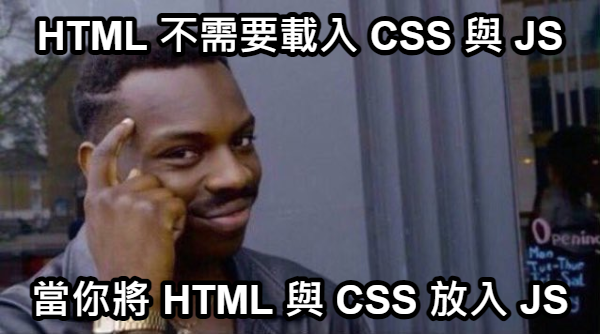

# 第二章：動態注入數據到JSX

在React開發中，JSX允許我們以一種聲明式的方式來描述用戶界面。通過在JSX中動態注入數據，我們可以使我們的應用更加動態和互動。



## 2.1 在JSX中使用JavaScript表達式

要在JSX中使用JavaScript表達式，只需將其包裹在大括號`{}`中。你可以注入變量、函數調用、以及任何其他有效的JavaScript表達式。這包括：

- 變量和常數
- 字符串文本
- 數字計算
- 函數調用
- 對象轉換為字符串

### 示例分析

以下是一些在JSX中動態注入數據的基本示例：

- **渲染變量**：可以將JavaScript變量直接注入到JSX中。
  ```jsx
  const userName = 'Alice';
  <h1>Hello, {userName}</h1>
  ```

- **數字和計算**：你可以注入數字，或直接在JSX中進行計算。
  ```jsx
  <p>{2 + 3}</p>
  ```

- **字符串**：可以直接注入字符串或字符串變量。
  ```jsx
  <p>{'Hello, world!'}</p>
  ```

- **對象轉字符串**：直接注入對象會引發錯誤，需要將其轉換為字符串。
  ```jsx
  const user = { name: 'Alice', age: 30 };
  <p>{JSON.stringify(user)}</p>
  ```

- **函數調用**：可以注入函數的返回值。
  ```jsx
  const greet = () => 'Hello, world!';
  <p>{greet()}</p>
  ```

- **在屬性中使用對象**：可以將對象用作元素的屬性值使用。
  ```jsx
  const textStyle = { color: 'red', fontSize: '20px' };
  <p style={textStyle}>This is a text with style.</p>
  ```
  
- **事件處理**：可以在元素上定義事件處理，並調用函數。
  ```jsx
  const handleClick = () => alert('Button clicked!');
  <button onClick={handleClick}>Click me</button>
  ```

這些示例展示了在JSX中如何利用JavaScript表達式來注入動態數據，使得React組件更加靈活和動態。

## 2.2 那麼在大括號`{}`中的內容可以是什麼呢？

在大括號中，你可以使用任何有效的JavaScript表達式。以下是一些基本規則：

- **有效的表達式**：你可以注入變量、執行計算、調用JavaScript函數等。
- **無效的表達式**：不可以直接在大括號中使用JavaScript的語句，如條件語句（if）、循環（for、while）等。這些需要用不同的方式來實現。

## 2.3 練習題

1. 創建一個變量`message`，包含你想在頁面上顯示的歡迎信息。然後在JSX中渲染這個消息。
2. 定義一個函數`calculateArea`，接受一個半徑作為參數，計算並返回圓的面積。在JSX中調用這個函數並渲染結果，假設半徑

為5。
3. 創建一個對象`person`，包含`firstName`和`lastName`。使用`JSON.stringify`在JSX中將這個對象渲染為字符串。
