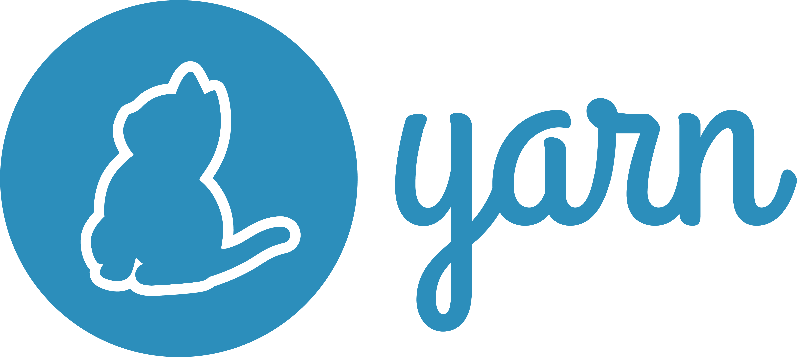
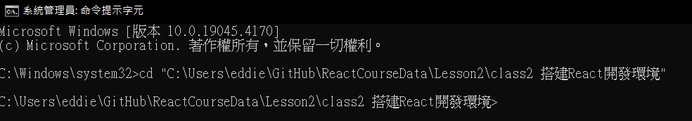
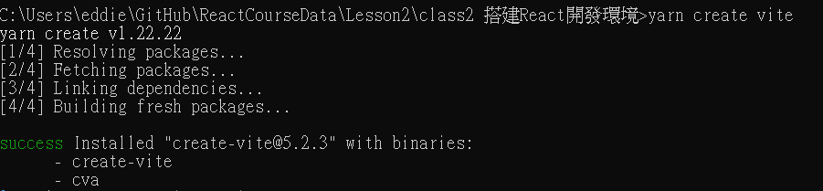
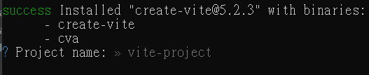
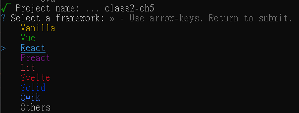
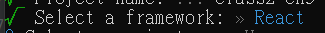
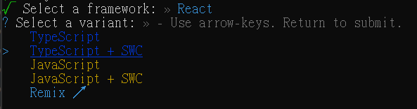
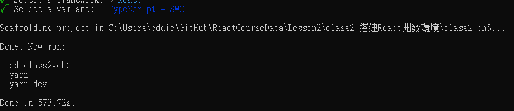
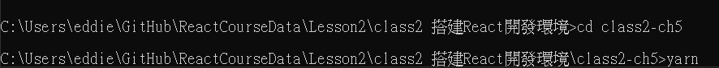
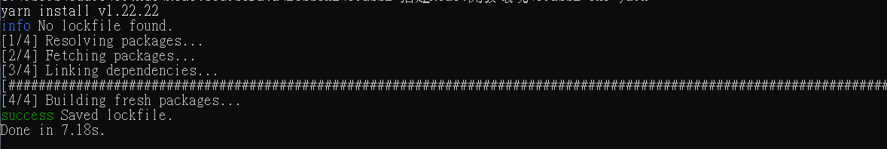

# 第一章：使用Vite搭建React開發環境

在這一節中，我們將學習如何使用Yarn和Vite來快速搭建一個React開發環境。Yarn是一個強大的JavaScript包管理工具，它提供了比npm更快的依賴安裝速度、更嚴格的包版本控制和更安全的包管理策略。

## 1.1  安裝Yarn

1. **安裝Node.js**：Yarn需要Node.js環境。如果你還沒有安裝Node.js，請先從[Node.js官網](https://nodejs.org/)下載並安裝。

2. **安裝Yarn**：安裝了Node.js後，你可以通過npm來安裝Yarn。打開終端（Terminal），執行以下命令：
   ```sh
   npm install -g yarn
   ```
   上方命令的`-g`的意思是安裝在全域，這樣之後就不用再下載一次了


圖片來源自 https://www.pngaaa.com/detail/4253253

## 1.2 Yarn與npm的優勢

你或許很好奇我們在裝載`Node.js`的時候已經安裝了`npm`，為什麼還要安裝`Yarn`呢？這是因為`Yarn`在某些方面有著比`npm`更好的優勢：

- **速度**：Yarn在處理依賴的下載和安裝上通常比npm更快，這得益於其並行處理依賴的能力以及更好的緩存機制。
- **安全性**：Yarn在安裝過程中會校驗每個安裝包的完整性，以確保代碼未被篡改。
- **版本控制**：Yarn的`yarn.lock`文件記錄了被安裝依賴的確切版本，確保團隊成員或部署環境中的依賴安裝結果一致。
- **用戶體驗**：Yarn提供了更友好的命令行界面，包括清晰的錯誤報告和過程提示。

## 1.3 Yarn 使用

與 `npm` 類似，`Yarn` 也有一系列的命令可以用來管理項目的依賴。以下是一些常用的 `Yarn` 命令：

- **`yarn init`**：初始化一個新的項目，並生成一個 `package.json` 文件。
- **`yarn add <package>`**：安裝一個新的依賴包。
- **`yarn remove <package>`**：移除一個依賴包。
- **`yarn install`**：安裝所有依賴包。可以簡寫為 `yarn`。
- **`yarn upgrade`**：升級所有依賴包。

實踐上，網路上寫的`npm`的指令，都可以用`yarn`來替代，例如`npm install`可以用`yarn add`來替代。

## 1.4 使用Vite創建React項目

Vite是一個現代化的前端開發工具，它提供了快速的開發環境和即時熱重載功能，讓開發者可以更快地構建React應用。下面我們將使用Yarn和Vite來初始化一個新的React項目。如果你熟悉早期的鷹架工具`create-react-app`，你會發現Vite的速度更快，並且提供了更好的開發體驗。


圖片來源自 wikipedia

- 除了React，Vite還支持Vue、Preact、Lit等框架。在本課程中，我們將使用React作為示範。
- 我們將使用`SWC`作為Vite的程式框架，`SWC`是一個快速的JavaScript/TypeScript編譯器，可以幫助我們更快的編譯程式碼。其底層是用Rust語言實現的。具體可以快高達10倍以上。


圖片來源自 https://github.com/swc-project/swc

### 1.4.1 創建一個新的React項目

1. **移動到項目目錄**：首先，打開終端（Terminal），移動到你想要創建項目的目錄下。
   以系統管理員打開 PowerShell
   ```shell
   cd ".\lesson2\class2 搭建React開發環境\"
   ```
   或如果你有安裝bash
   ```bash
   cd Lesson2/class2\ 搭建React開發環境/
   ```
   如下圖
   

2. **初始化一個新的Vite項目**：執行以下命令，使用Yarn和Vite初始化一個新的項目。

   ```bash
   yarn create vite
   ```
    如下圖
    

3. **命名你的項目**：為該項目命名。

   前個步驟完成後如下，你會看到個 `? Project name: >> `

   

   在後方輸入你的項目名稱，然後按下 `Enter` 鍵。

   你可以輸入任何你想要的名稱，例如：`class2-ch5`。但是，請注意**都用小寫字母，不要有空格。單詞用 `-` 連接**。
   ```bash
   ? Project name: >> class2-ch5
   ```
   你會看到個 `✔ Project name: >> class2-ch5` 代表項目名稱已經輸入成功，如下圖

    

4. **選擇React框架**：選擇`React`作為你的項目框架

   前個步驟完成後如下，下方你會看到個 `? Select a framework: >> `，用鍵盤上的上下鍵選擇，然後按下 `Enter` 鍵。

    

    你會看到個 `✔ Select a framework: >> React` 代表React框架已經選擇成功，如下圖
   
    

5. **選擇程式框架**：本次課程示範將使用 `TypeScript + SWC` 作為程式框架。
   - 這邊選擇 `TypeScript` 是因為程式碼不論是 `TypeScript` 或 `JavaScript` 都會被 Vite (鷹架工具) 編譯成 `JavaScript` 來執行，但 `TypeScript` 有更好的型別檢查功能，可以幫助開發者更快找到程式碼錯誤。
   - 使用 `SWC` 是因為 `SWC` 是一個快速的 JavaScript/TypeScript 編譯器，可以幫助我們更快的編譯程式碼。

   前個步驟完成後如下，下方你會看到個 `? Select a variant: >> `，用鍵盤上的上下鍵選擇，然後按下 `Enter` 鍵。
    
   
   
   你會看到個 `✔ Select a variant: >> TypeScript + SWC` 代表程式框架已經選擇成功，當你看到 `Done in <Second>s` 時，代表已經設置完成。如下圖
   
   

6. **初始化環境**：用以下命令來進入項目目錄。並下載項目所需的依賴包。
   
   前個步驟完成後，項目已經出現在你的目錄下。

    進入項目目錄
   ```bash
   cd class2-ch5
   ```
   
    下載項目所需的依賴包
   ```
   yarn 
   ```
   

    完成後如下，當你看到 `Done in <Second>s` 時代表項目依賴包下載完成。

   

### 1.4.2 練習

- 跟隨上述步驟，使用Yarn和Vite初始化一個新的React項目。
