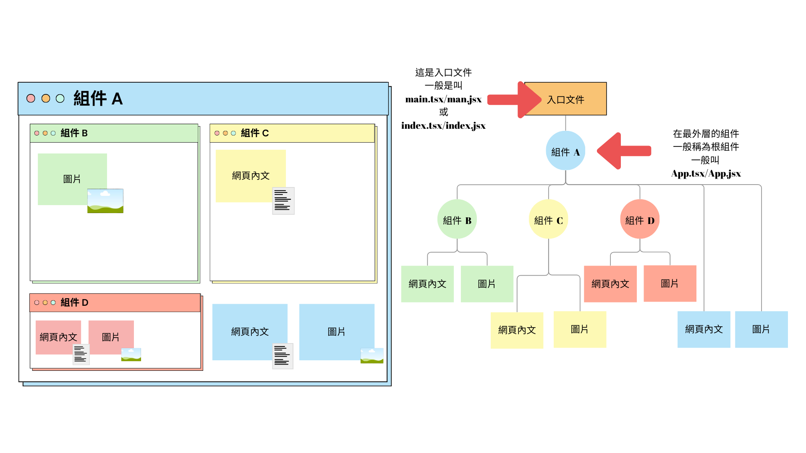
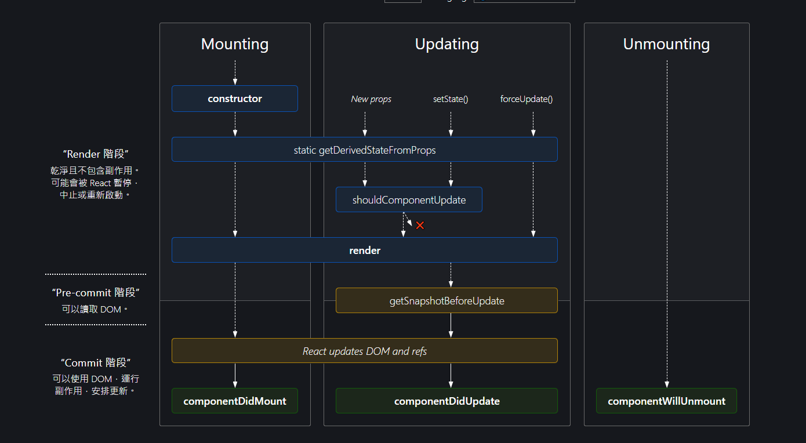

# 第一章：組件介紹

本章將介紹React組件的基本概念，解釋組件在React應用中的核心作用，並闡述使用組件的好處。

## 1.1 什麼是組件？

組件是React應用的基礎建築塊。它們是獨立且可重用的程式碼塊，用於定義應用的各個部分。每個組件都封裝了應用的一部分行為和呈現，通過組合它們，可以構建複雜且功能豐富的用戶界面。

- 組件層次結構：
  - 組件可以包含其他組件，形成一個層次結構。
  - 這種結構有助於將UI分解成獨立、可管理的部分，每個部分都有自己的職責和生命周期。
  - 這種結構還使得組件可以被重用，從而提高了程式碼的可維護性和可擴展性。
  - 這種結構近似資料結構中的樹狀結構，其中每個節點都是一個組件。

    ```jsx
    const App = () => {
      return (
        <>
          <Header />
          <Content />
          <Footer />
        </>
      );
    }
    ```
上述程式碼定義了一個名為`App`的組件，它包含了三個子組件：`Header`、`Content`和`Footer`。

- 組件作為函數：
  - 從技術角度來看，組件可以被視為會回傳HTML元素的JavaScript函數。
  - 這些元素最終被渲染到網頁上，形成用戶可交互的界面。

    ```jsx
    const Welcome = (props) => {
      return <h1>Hello, {props.name}</h1>;
    }
    ```
上述程式碼定義了一個簡單的函數組件，它接收一個名為`props`的參數，並返回一個`h1`元素，其中包含從`props`接收的`name`。


這張圖說明了組件的層次結構，每個組件都可以包含其他組件，形成一個組件樹。

## 1.2 為什麼使用組件？

使用組件的主要理由是為了提高應用的模塊性、重用性和清晰度。

- 模塊化：
  - 組件允許開發者將 UI 的不同部分封裝成獨立、封閉的單元，每個單元都有自己的功能和樣式。
  - 這使得開發和維護大型應用更加容易。
  - 就我的接的案子來說，很少有單一檔案超過400行，通常都是100-200行 (~~你是否有寫出超過數千行的單一檔案呢~~)。
- 重複使用 (重用性)：
  - 一旦創建了一個組件，它就可以在不同的地方重用，無需重新編寫相同的程式碼。
  - 不僅節省開發時間，也提高了程式碼的一致性。
  - 簡單來說，像函數一樣，組件可以被多次調用，從而實現減少重新編寫程式碼次數。
- 清晰度：
  - 組件化的應用通常更容易理解和測試，因為不同的功能區塊被清晰地劃分。
  - 維護與除錯能專注於單個組件，而不是整個應用。

## 1.3 組件的類型

React提供了兩種主要的組件類型：類別組件和函數組件。

- 類別組件：
  - 使用ES6類來創建的組件。
  - 使開發者能夠利用更豐富的功能，如內部狀態管理和生命週期控制。
  - 在接下來章節中，我們將學習如何創建和使用類別組件。

    ```jsx
    class Welcome extends React.Component {
      render() {
        return <h1>Hello, {this.props.name}</h1>;
      }
    }
    ```
- 函數組件：
  - 使用普通JavaScript函數來創建的組件。
  - 隨著React Hooks的引入，函數組件現在也可以使用狀態和其他React特性。
  - 公司一般是使用函數組件，因為它編譯後的程式碼比類別組件少，且較為簡潔。
  - 在講解完類別組件後，我們將學習如何創建和使用函數組件。

    ```jsx
    const Welcome = (props) => {
      return <h1>Hello, {props.name}</h1>;
    }
    ```

## 1.4 組件的生命週期

每個組件在其存在期間都會經歷多個“生命週期階段”。
React提供了允許開發者在這些階段執行程式碼的生命週期方法，如：
- `componentDidMount`: 掛載階段，組件被創建並插入DOM中。
- `componentDidUpdate`: 更新階段: 組件的props或state發生變化，導致組件重新渲染。後面課程會詳細介紹。
- `componentWillUnmount`: 卸載階段: 組件從DOM中移除。

這些階段提供了在組件的不同點執行操作的機會，這對於進行資源清理、執行動畫等操作至關重要。


圖片來源: https://projects.wojtekmaj.pl/react-lifecycle-methods-diagram/
