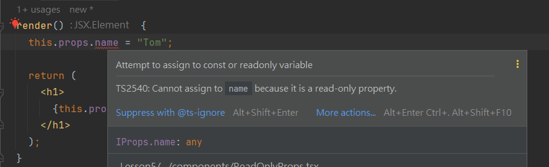

# 第二章：React 組件屬性進階一

## 2.1 介紹 `props` 的唯讀特性

在 React 中，組件間的數據傳遞是通過 `props`（properties 的縮寫）實現的。這一節將詳細介紹 `props` 的唯讀特性，以及這一設計如何影響數據流和組件間的互動。

### 2.1.1 唯讀性的定義和重要性
`props` 的唯讀特性意味著一旦數據被傳遞到組件中，該組件就無法直接修改接收到的 `props`。這是 React 的基本原則之一，目的是確保數據的不可變性，從而減少程序運行時的複雜性，提高應用的性能和可靠性。

- 數據不可變性：在 React 中，所有的 `props` 都應該被視為不可變數據。這意味著，當需要基於當前 `props` 更新組件狀態或執行操作時，不應直接修改 `props`，而應該使用更安全的方式來處理數據。

- 單向數據流：`props` 的唯讀性強化了 React 的單向數據流模型。數據只能從父組件流向子組件，這種方式使得組件的行為更加可預測，並且更容易追踪數據在組件樹中的流動。

### 2.1.2 如何實現唯讀性
在實踐中，當你嘗試在子組件內部直接修改 `props` 時，React 會拋出錯誤，提示 `props` 是唯讀的。以下是一個簡單的例子來說明這一點：

```tsx
interface IProps {
  name: string;
}

class ReadOnlyProps extends Component<IProps> {
  render() {
    this.props.name = "Tom"; // 這裡會拋出錯誤

    return (
      <h1>
        {this.props.name}
      </h1>
    );
  }
}
```

在上述例子中，嘗試修改 `props.name` 的值會導致錯誤。這是因為 `props` 是唯讀的，React 不允許直接修改 `props` 的值。



### 2.1.3 但，真的不能修改 `props` 呢？

答案是：_**否定的，這是個面試經典陷阱問題**_。雖然 `props` 定義與傳遞的數據是唯讀的，但是在某些情況下，我們是可以修改 `props` 的值的。

- 如果 `props` 是物件或數組，由於物件和數組是引用類型，所以我們可以修改物件或數組中的屬性或元素，而不會導致錯誤。

- `props` 唯讀檢查並不會檢查到上方所說的複雜類型的值變更。

以下是一個例子：

```tsx
interface IProps {
  user: {
    name: string;
    age: number;
  };
}

class ModifyProps extends Component<IProps> {
  render() {
    this.props.user.name = "Tom"; // 不會拋出錯誤

    return (
      <h1>
        {this.props.user.name}
      </h1>
    );
  }
}
```

但是，雖然我們可以修改 `props` 中的物件或數組，但這樣做是不推薦的。因為這樣做會破壞 React 的數據流模型，增加程式碼的複雜性，並且可能導致應用的不穩定性。

**因此，實作中應該遵循 React 的設計原則，將 `props` 視為唯讀數據，並使用更安全的方式來處理數據。**

## 2.2 `props` 傳遞數據類型

在 React 中，`props` 可以傳遞任何類型的數據，包括基本數據類型（如字符串、數字、布爾值等）、複雜數據類型（如物件、數組等）以及函數。

### 2.2.1 基本數據類型

基本數據類型是指 JavaScript 中的原始數據類型。

- 字符串：`"Hello, World!"`
- 數字：`123`
- 布爾值：`true` 或 `false`
- 空值：`null` 或 `undefined`
- 陣列：`[1, 2, 3]`
- 物件：`{ name: "Tom", age: 18 }`
- 函數：`() => { console.log("Hello, World!"); }`

### 2.2.2 一些特殊的數據類型

`props` 也可以傳遞一些特殊的數據類型，這些是你可能會忘記的：

1. 元素：
   - React 元素或組件是可以通過 `props` 傳遞的。當你將一個 React 組件作為 `props` 傳遞時，你實際上是在傳遞一個能夠產生元素的函數。
   - 還記得 `Babel` 編譯後的 JSX 嗎？ JSX 會被編譯成 `React.createElement()`，這就是一個函數。
    ```jsx
    const WelcomeMessage = () => <h1>Welcome to the app!</h1>;
    
    // 傳遞 React 組件
    <SomeComponent headerComponent={WelcomeMessage} />
    ```

2. 組件實例：
   - 雖然通常不推薦將組件實例作為 `props` 傳遞，因為它打破了組件獨立性的原則，但技術上是可行的。這通常在高階組件或特殊的package中使用。

    ```jsx
    // 傳遞 React 組件的實例化結果
    <SomeComponent customComponent={<WelcomeMessage />} />
    ```

### 2.3 `props` 特殊屬性

在 React 中，`props` 還有一些特殊屬性用於控制組件的行為或樣式，這些特殊屬性使得組件更靈活和功能豐富。

### 2.3.1 `children`

`children` 是 React 中一個非常重要的 `props`，它代表組件標籤內部傳入的內容。它可以是任意的 JSX，包括基本數據類型、React 元素、甚至是另一個組件。

- 用法：你可以在父組件中像添加 HTML 內容一樣添加 `children`，然後在子組件中通過 `this.props.children` 訪問這些內容。
- 注意：`children` 是一個特殊的 `props`，它是一個隱含的 `props`，不需要額外定義。

    ```tsx
    import { Component } from 'react';
  
    // 父組件
    class Parent extends Component {
      render() {
        return (
          <div>
            <h1>Parent Component</h1>
            <Child>
              <p>This is a child component.</p>
            </Child>
          </div>
        );
      }
    }
  
    interface IChildProps {
      children: React.ReactNode;
    }
  
    // 子組件
    class Child extends Component<IChildProps> {
      render() {
        return (
          <div>
            <h2>Child Component</h2>
            {this.props.children}
          </div>
        );
      }
    }
    ```

### 2.3.2 `key`

`key` 是一個由 React 自動使用的特殊屬性，主要用於動態子元素列表時提高渲染性能。當元素有序列變動時，`key` 幫助 React 識別哪些元素是新的，哪些元素是更新的。

- 用法：當你在渲染列表或數組時，每個子元素都應該有一個獨特的 `key` 屬性。
- 這邊再次提醒：`key` 是 React 的特殊屬性，不應該被當作一般的 `props` 來使用。

    ```tsx
    const dataList = ['Apple', 'Orange', 'Banana'];

    // 渲染列表
    const listItems = dataList.map((item: string, index: number) => (
      <li key={index}>{item}</li>
    ));
    ```

### 2.3.3 `style` 和 `className`

- `style` 允許你以對象形式直接指定內聯樣式，而 `className` 允許你引用 CSS 中的樣式類。
- 這在前面已經提到過，這裡複習一下。

    ```jsx
    // 使用 style
    <div style={{ color: 'red', fontWeight: 'bold' }}>This is a red text.</div>

    // 使用 className
    <div className="highlight">This is highlighted text.</div>
    ```

### 2.3.4 特殊的事件處理 `props`

React 支持在組件上直接綁定事件處理器，如 `onClick`、`onHover` 等。

- 用法：可以直接在 JSX 標記中添加事件處理器，類似於在 HTML 元素上添加事件。用起來也十分接近原生事件。
- 實踐上這個事件與原生的事件有些許不同，React 事件為了在各個瀏覽器上保持一致性，使用了合成事件。

    ```tsx
    const handleButtonClick = (event: React.MouseEvent<HTMLButtonElement>) => {
      console.log("Button was clicked!", event);
    };

    // 使用時
    const buttonElement = <Button onClick={handleButtonClick} />;
    ```

### 2.3.5 練習題

#### 子元素傳遞
創建一個名為 Card 的組件，該組件接受任何傳入的子元素並將它們渲染在一個帶有邊框的容器中。
使用此組件並傳入一些文本和圖像。

## 2.4 React 類別組件的`constructor`參數

在 React 類別組件中，`constructor` 是一個特殊的方法，用於創建和初始化類別對象。當實現 React 組件時，通過 `constructor` 可以接收外部傳入的 `props`，並將其進一步傳遞給父類的構造函數，即 `React.Component`。
- 回想起物件導向納提到的繼承概念，子類在使用父類的屬性和方法之前，需要先調用父類的構造函數。

### 2.4.1 `constructor` 和 `super` 的基本用法

當你在 React 組件中定義 `constructor`，通常需要調用 `super(props)`。這樣做是因為在 JavaScript 的類繼承機制中，子類在能夠使用 `this` 之前，必須首先調用父類的構造函數。

```tsx
interface IMyComponentProps {
  initialCount: number;
}

class MyComponent extends React.Component<IMyComponentProps> {
    constructor(props) {
        super(props); // 調用父類的 constructor，傳遞 props
        console.log(this.props); // 現在可以安全地使用 this.props
    }
}
```

### 2.4.2 未傳遞 `props` 到 `super` 的後果

如果你忽略將 `props` 傳遞給 `super`，則在構造函數中和組件的初始化階段，`this.props` 將會是 `undefined`，這可能會導致後續程式碼中對 `props` 的操作產生錯誤。
- 實際上下方 `render` 方法中的 `this.props` 不是 `undefined`，但在構造函數中是。
- 在React的類組件中，constructor函數是最早被調用的部分。當你調用super()但不傳遞props時，React在 `constructor` 完成後仍然會把 `props` 賦值給 `this.props`。但這個賦值過程發生在 `constructor` 之後，因此在 `constructor` 內部直接訪問 `this.props` 可能得到 `undefined`。
```tsx
interface IMyComponentProps {
  initialCount: number;
}

class MyComponent extends React.Component<IMyComponentProps> {
    constructor(props) {
        super(); // 沒有將 props 傳遞給 super
        console.log(this.props); // 這裡 this.props 將是 undefined
    }
}
```

### 2.4.3 ES7 語法中的`constructor`簡化

在現代的 React 開發中，特別是使用 ES7 或更高版本的 JavaScript 時，經常會看到開發者在類組件中省略 `constructor` 的寫法。這種情況下，即使沒有明確寫出 `constructor` 和 `super(props)`，React 也會隱式地處理這些事情，確保 `props` 被正確地傳遞。

- 當你使用像 Babel 這樣的轉譯器，並且在組件中省略了 `constructor` 時，轉譯後的程式碼其實仍然會包括對 `super(props)` 的調用。
- 這是因為 ES6 的類構造函數規定，如果子類要使用 `this`，就必須先調用 `super()`，且在擴展了其他類的類中，`super()` 必須傳入 `props` 以保證組件功能的正常。

```tsx
interface IMyComponentProps {
  name: string;
}

interface IMyComponentState {
  message: string;
}

class MyComponent extends React.Component<IMyComponentProps, IMyComponentState> {
    state = {
        message: 'Hello, World!'
    };

    render() {
        return <div>{this.state.message} - {this.props.name}</div>;
    }
}
```

在上述程式碼中，即使沒有顯示地定義 `constructor` 和 `super(props)`，轉譯後一樣能夠正常運行。
