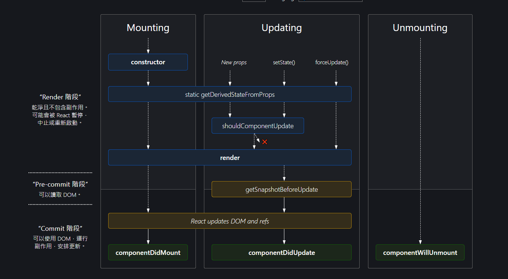

# 第一章：組件的生命週期

## 1.1 理解生命週期

還記得之前講述的這張圖片嗎?



React 組件的生命週期是指組件在不同階段的行為和方法，這些階段包括：

- 掛載階段：
    - 組件第一次在 DOM 中渲染的過程，涉及構造函數、`render` 方法
    - 方法 `componentDidMount` 的執行。
- 更新階段：
    - 組件在接收到新的 props 或 state 變化時進行更新
    - 涉及 `shouldComponentUpdate`、`componentDidUpdate` 的執行。
- 卸載階段：
    - 組件從 DOM 中移除之前的階段
    - 涉及 `componentWillUnmount` 方法的執行。

## 1.2 掛載階段 `Mounting`

### 1.2.1 `conponentDidMount` 方法

如同之前所述，`componentDidMount` 是在組件第一次渲染完成後執行的方法。這個方法通常用於執行一些初始化操作，例如：

- 請求數據
- 設置定時器
- 註冊事件監聽器

### 1.2.2 實際應用

在 React 中，我們可以在 `componentDidMount` 方法中發送請求，並將數據保存到組件的狀態中。這樣可以確保數據在組件渲染之前已經準備好。

```tsx
interface IUser {
  id: number;
  name: string;
}

interface IUserListState {
  users: IUser[];
}

class UserList extends React.Component<{}, IUserListState> {
  state = {
    users: []
  };

  componentDidMount() {
    fetch('https://api.example.com/users')
      .then(response => response.json())
      .then(data => this.setState({users: data}));
  }

  render() {
    return (
      <div>
        {this.state.users.map(user => (
          <div key={user.id}>{user.name}</div>
        ))}
      </div>
    );
  }
}
```

在這個例子中，我們在 `componentDidMount` 方法中發送了一個請求，並將獲取的用戶數據保存到組件的狀態中。這樣可以確保數據在組件渲染之前已經準備好。

### 1.2.3 注意事項

- `componentDidMount` 方法只會在組件第一次渲染完成後執行一次。也就是掛載階段只會執行一次。除非組件被卸載再重新掛載。
- 如果需要在組件更新時執行一些操作，可以使用 `componentDidUpdate` 方法。

## 1.2.4 練習

我們實際操作中山大學選課系統資料，透過 API 取得課程資料，並顯示在畫面上。

- 取得 112 學年度第 2 學期的課程資料第一頁
- 將課程名稱(`name`)、學分(`credit`)、老師(`teacher`)、教室(`room`) 顯示在畫面上。
- 架構是一個 `CourseList` 組件，裡面包含多個 `Course` 組件。
- [https://whats2000.github.io/NSYSUCourseAPI/1122/20240506_031415/page_1.json](https://whats2000.github.io/NSYSUCourseAPI/1122/20240506_031415/page_1.json)

## 1.3 更新階段 `Updating`

### 1.3.1 `componentDidUpdate` 方法

`componentDidUpdate` 是在組件更新後立即調用的方法。

- 它提供了一個機會來執行操作，這些操作可能依賴於組件最近渲染的 DOM。
- 使用場景：適合用於處理組件依賴的外部資源或延遲的第三方庫集成，如圖表或地圖庫。
- 包含三個參數：`prevProps`、`prevState`、`snapshot`。
  - `prevProps`：表示更新前的 props。
  - `prevState`：表示更新前的 state。
  - `snapshot`：這個我們不會在這個課程中使用到。

### 1.3.2 實際應用

可以利用更新後的 prop 或 state 來執行邏輯，比如對比前後兩次的 prop 值，並根據變化來執行特定的操作。


```tsx
interface IProfileProps {
  userID: number;
}

interface IProfileState {
  userData: UserData;
}

class Profile extends React.Component<IProfileProps, IProfileState> {
  state = {
    userData: {}
  };

  componentDidMount() {
    this.fetchUserData(this.props.userID);
  }

  componentDidUpdate(prevProps: Props) {
    if (this.props.userID !== prevProps.userID) {
      this.fetchUserData(this.props.userID);
    }
  }

  fetchUserData(userID: number) {
    fetch(`https://api.example.com/users/${userID}`)
      .then(response => response.json())
      .then(data => this.setState({userData: data}));
  }

  render() {
    return <div>{/* Display user data */}</div>;
  }
}
```

此例中，若 `userID` prop 發生變化，組件將會重新從 API 獲取新的用戶數據。

### 1.3.3 注意事項

- `componentDidUpdate` 方法會在組件更新後立即調用，但是不會在組件第一次渲染時調用。
- 在 `componentDidUpdate` 方法中，可以訪問 `this.props` 和 `this.state` 的值，並比較它們與更新前的值。
- **請注意**：在 `componentDidUpdate` 方法中，如果需要更新 state，由於會觸發組件重新渲染，而這又會觸發 `componentDidUpdate` 方法，因此必須謹慎使用，以避免無限循環。
  - 使用時 **必須** 搭配條件判斷，避免無限循環。
  - 例如：`if (this.props.userID !== prevProps.userID) { // 含有 setState 操作 }`
  - 這樣可以確保只有在 `userID` 發生變化時才會觸發 `setState` 操作。

### 1.3.4 練習題

假設你正在開發一個用戶資訊管理系統，需要實現一個功能：當用戶資訊更新時，系統會自動檢查並更新用戶的積分等級。每當用戶的消費紀錄發生變化時，用戶的積分等級可能會提升或下降。你的任務是使用 `componentDidUpdate` 方法來實現這一功能。

#### 題目要求
  1. 創建一個 `UserComponent` 類組件，其中包含用戶的姓名、消費總額和積分等級。
  2. 利用 `componentDidUpdate` 方法，每當用戶的消費總額發生變化時，根據以下規則更新積分等級：
    - 消費總額小於 1000 元，積分等級為 "Bronze"
    - 消費總額在 1000 至 5000 元之間，積分等級為 "Silver"
    - 消費總額超過 5000 元，積分等級為 "Gold"
  3. 在組件中添加按鈕，每點擊一次按鈕，消費總額增加 500 元。
